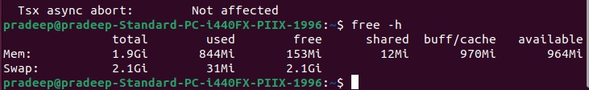
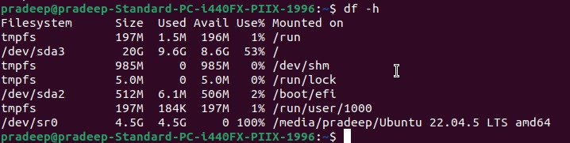
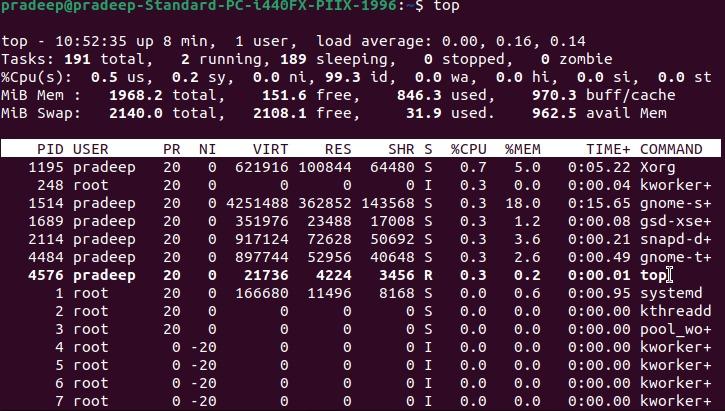
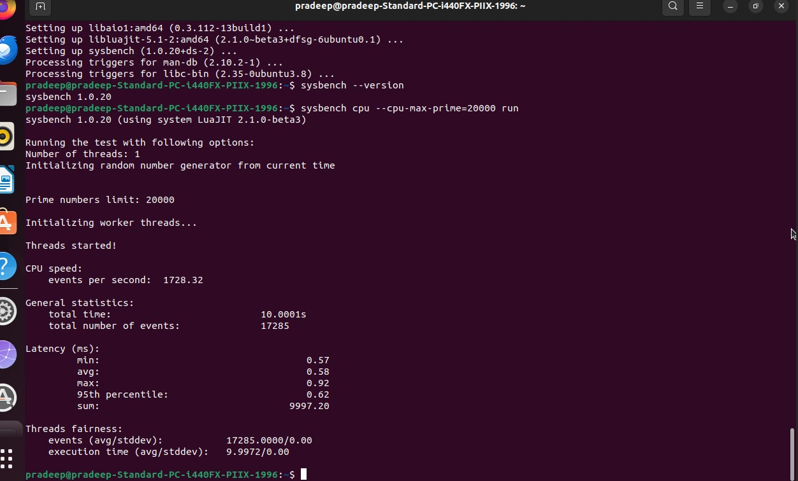

# Experiment 1: Performance Analysis of Type-1 and Type-2 Hypervisors

## 1. Aim

To study and compare Type-1 and Type-2 hypervisors by creating virtual machines, configuring virtual resources, monitoring system performance, and performing CPU benchmarking using Sysbench.

---

## 2. Objectives

The objectives of this experiment are:

* To understand the concept of virtualization.
* To understand the role and working of a hypervisor.
* To study the two major types of hypervisors.
* To understand the architecture of Type-1 and Type-2 hypervisors.
* To configure and run a virtual machine using a Type-1 hypervisor.
* To configure and run a virtual machine using a Type-2 hypervisor.
* To study CPU, memory, disk, and operating system configurations.
* To monitor CPU and memory resource utilization.
* To install and use Sysbench for CPU benchmarking.
* To collect CPU performance measurements.
* To compare the performance characteristics of Type-1 and Type-2 virtualization environments.

---

# 3. Introduction

Virtualization is a technology that allows a single physical computer to run multiple virtual machines.

A **Virtual Machine (VM)** is a software-based computer that behaves like a physical computer. It can have its own operating system, CPU allocation, memory, storage, and network interface.

The physical resources of a computer are shared among virtual machines through a software layer called a **hypervisor**.

A hypervisor is responsible for:

* Creating virtual machines.
* Allocating CPU resources.
* Allocating memory resources.
* Managing virtual storage.
* Managing virtual network interfaces.
* Controlling access to physical hardware.
* Providing an environment in which guest operating systems can execute.

Hypervisors are mainly classified into two types:

1. **Type-1 Hypervisor**
2. **Type-2 Hypervisor**

In this experiment:

* **Proxmox VE** is studied as a Type-1 hypervisor.
* **VMware Workstation** is studied as a Type-2 hypervisor.
* **Ubuntu** is used as the guest operating system.

System configuration and resource utilization are observed, and CPU performance is measured using **Sysbench**.

---

# 4. Virtualization Architecture

The basic virtualization process can be represented as:

```text
                 Physical Hardware
                        |
                        v
                   Hypervisor
                        |
              +---------+---------+
              |                   |
              v                   v
        Virtual Machine 1   Virtual Machine 2
              |                   |
              v                   v
        Guest Operating     Guest Operating
           System               System
```

---

# 5. Types of Hypervisors

## 5.1 Type-1 Hypervisor

A Type-1 hypervisor is also called a **bare-metal hypervisor**.

It runs directly on the physical hardware without requiring a conventional host operating system below the hypervisor.

### Architecture

```text
+----------------------------------+
|       Guest Operating System     |
+----------------------------------+
|          Virtual Machine         |
+----------------------------------+
|          Type-1 Hypervisor       |
+----------------------------------+
|         Physical Hardware        |
+----------------------------------+
```

In this experiment, **Proxmox VE** is used as the Type-1 hypervisor.

The hypervisor directly manages the physical hardware and provides virtualized resources to the virtual machines.

### Characteristics of Type-1 Hypervisor

* Runs directly on physical hardware.
* Does not depend on a general-purpose host operating system.
* Provides virtual CPU, memory, storage, and networking.
* Can manage multiple virtual machines.
* Provides centralized virtual machine management.
* Commonly used in servers and data centers.

---

## 5.2 Type-2 Hypervisor

A Type-2 hypervisor is also called a **hosted hypervisor**.

Unlike a Type-1 hypervisor, a Type-2 hypervisor runs on top of an existing host operating system.

### Architecture

```text
+----------------------------------+
|       Guest Operating System     |
+----------------------------------+
|          Virtual Machine         |
+----------------------------------+
|          Type-2 Hypervisor       |
+----------------------------------+
|        Host Operating System     |
+----------------------------------+
|         Physical Hardware        |
+----------------------------------+
```

In this experiment, **VMware Workstation** is used as the Type-2 hypervisor.

The host operating system provides the basic hardware environment, while VMware Workstation creates and manages the virtual machines.

### Characteristics of Type-2 Hypervisor

* Runs on top of a host operating system.
* Uses the host operating system to access hardware resources.
* Provides virtual machines for running guest operating systems.
* Easy to install and use on desktop computers.
* Suitable for development, testing, learning, and experimentation.
* Introduces an additional software layer between the virtual machine and physical hardware.

---

# 6. Comparison of Type-1 and Type-2 Hypervisors

| Feature          | Type-1 Hypervisor                     | Type-2 Hypervisor                       |
| ---------------- | ------------------------------------- | --------------------------------------- |
| Other Name       | Bare-metal hypervisor                 | Hosted hypervisor                       |
| Runs On          | Physical hardware                     | Host operating system                   |
| Host OS Required | No conventional host OS               | Yes                                     |
| Hardware Access  | Directly managed by hypervisor        | Through host OS                         |
| Example Used     | Proxmox VE                            | VMware Workstation                      |
| Typical Usage    | Servers and data centers              | Desktop and development environments    |
| Virtual Machines | Multiple VMs can be managed           | Multiple VMs can be created             |
| Management       | Centralized virtualization management | Desktop-based virtualization management |
| Experiment       | Ubuntu VM                             | Ubuntu VM                               |

---

# 7. Experimental Environment

## 7.1 Type-1 Hypervisor

The Type-1 virtualization environment uses:

* **Hypervisor:** Proxmox VE
* **Guest Operating System:** Ubuntu
* **Virtual Machine:** Ubuntu VM
* **Performance Tool:** Sysbench
* **Monitoring Tool:** `top`
* **Memory Analysis:** `free -h`
* **Disk Analysis:** `df -h`

---

## 7.2 Type-2 Hypervisor

The Type-2 virtualization environment uses:

* **Hypervisor:** VMware Workstation
* **Host Operating System:** Host OS
* **Guest Operating System:** Ubuntu
* **Virtual Machine:** Ubuntu VM
* **Performance Tool:** Sysbench
* **Monitoring Tool:** `top`
* **CPU Information:** `lscpu`

---

# 8. Type-1 Hypervisor: Proxmox VE

## 8.1 Overview of Proxmox VE

Proxmox Virtual Environment (Proxmox VE) is used as the Type-1 hypervisor in this experiment.

It provides a virtualization platform for creating, configuring, running, and managing virtual machines.

As a Type-1 hypervisor, Proxmox operates directly on the physical machine and manages the hardware resources required by virtual machines.

### General Architecture

```text
+--------------------------------------+
|          Ubuntu Guest OS             |
+--------------------------------------+
|            Ubuntu VM                 |
+--------------------------------------+
|             Proxmox VE               |
|          Type-1 Hypervisor           |
+--------------------------------------+
|          Physical Hardware           |
+--------------------------------------+
```

The virtual machine is assigned CPU, memory, disk, and network resources.

The Proxmox management interface provides information about the virtualization environment and the running virtual machine.

---

## 8.2 Proxmox Dashboard

The Proxmox dashboard is the main management interface used to monitor and control the virtualization environment.

It provides an overview of the Proxmox node and the virtual machines running on it.

The dashboard can be used to observe:

* Virtual machine status.
* CPU utilization.
* Memory utilization.
* Storage information.
* Network information.
* Available virtualization resources.
* Virtual machine management options.

### Screenshot


### Explanation

The dashboard provides a centralized view of the virtualization environment.

It allows the administrator to identify the available node, virtual machines, storage resources, and current resource utilization.

This is the starting point for managing the virtual machine in the Proxmox environment.

---

## 8.3 Virtual Machine Configuration

The virtual machine is created and configured using Proxmox VE.

The VM configuration defines the virtual resources that are presented to the guest operating system.

The configuration includes:

* Virtual machine identification.
* Operating system.
* CPU configuration.
* Memory allocation.
* Virtual disk.
* Network interface.
* Other VM settings.

### Screenshot


### Explanation

This screenshot shows the configuration of the virtual machine.

The virtual machine does not directly receive the complete physical hardware. Instead, Proxmox allocates a specific amount of virtual CPU, memory, disk, and network resources.

These allocated resources are used by the Ubuntu guest operating system during execution.

The configuration is important because the amount of resources assigned to the VM directly affects its execution environment and performance.

---

## 8.4 Virtual Machine Running Status

After configuring the virtual machine, the VM is started through the Proxmox interface.

### Screenshot


### Explanation

This screenshot demonstrates that the configured virtual machine is running successfully.

The running VM represents an active guest operating system operating under the control of the Proxmox hypervisor.

At this stage, the hypervisor is responsible for:

* Allocating CPU execution time.
* Providing memory to the guest.
* Providing virtual storage.
* Managing the VM's network interface.
* Maintaining the VM execution environment.

The running state confirms that the virtual machine has successfully passed the configuration and startup stage.

---

## 8.5 Ubuntu Guest Operating System

Ubuntu is used as the guest operating system inside the Proxmox virtual machine.

### Screenshot


### Explanation

The Ubuntu console provides access to the guest operating system running inside the virtual machine.

System information can be collected from the guest operating system to verify the execution environment.

The console is also used for performing the required experiments such as:

* Checking memory.
* Checking disk usage.
* Monitoring CPU utilization.
* Installing Sysbench.
* Running CPU benchmarks.

This establishes the guest-side environment for performance analysis.

---

## 8.6 Memory Configuration

Memory is one of the important resources allocated to a virtual machine.

The memory configuration determines how much RAM is available to the guest operating system.

The Linux `free -h` command is used to observe memory-related information.

### Screenshot



### Explanation

The screenshot shows the memory information available inside the Ubuntu virtual machine.

The output provides information about:

* Total memory.
* Used memory.
* Free memory.
* Available memory.
* Swap memory.

Memory utilization is important because insufficient available memory can affect application and operating system performance.

The result also helps verify whether the memory allocated to the virtual machine is available correctly to the guest operating system.

---

## 8.7 Disk Configuration

Storage is provided to the virtual machine through a virtual disk.

The Linux `df -h` command is used to examine filesystem and disk-space utilization.

### Screenshot



### Explanation

The screenshot shows the disk-space information available inside the Ubuntu virtual machine.

The output provides information about:

* Total filesystem size.
* Used space.
* Available space.
* Percentage of filesystem utilization.
* Mount points.

The disk information helps verify that the virtual disk allocated through Proxmox is accessible to the guest operating system.

---

## 8.8 System Resource Utilization

System resource utilization is monitored using the Linux `top` utility.

### Screenshot



### Explanation

The `top` utility provides a real-time view of system activity.

It displays information related to:

* CPU utilization.
* Memory utilization.
* Running processes.
* System load.
* Process execution time.
* Process states.

This monitoring is useful for observing the behavior of the virtual machine while processes are executing.

Resource utilization also provides supporting information for the performance analysis.

---

## 8.9 Sysbench CPU Benchmark

Sysbench is used to measure CPU performance inside the Ubuntu virtual machine.

The same benchmark workload can be used in both virtualization environments so that the results can be compared.

### Screenshot



### Explanation

The Sysbench CPU benchmark performs repeated computational operations to measure CPU performance.

The benchmark provides measurements such as:

* Total execution time.
* Total number of events.
* Events per second.
* Minimum latency.
* Average latency.
* Maximum latency.

The obtained values are recorded for comparison with the Type-2 virtualization environment.

The benchmark should be performed under controlled conditions so that the measurements are comparable.

---

# 9. Type-2 Hypervisor: VMware Workstation

## 9.1 Overview of VMware Workstation

VMware Workstation is used as the Type-2 hypervisor in this experiment.

Unlike Proxmox VE, VMware Workstation operates on top of a host operating system.

### Basic Architecture

```text
+--------------------------------------+
|          Ubuntu Guest OS             |
+--------------------------------------+
|            Ubuntu VM                 |
+--------------------------------------+
|         VMware Workstation           |
|          Type-2 Hypervisor           |
+--------------------------------------+
|        Host Operating System         |
+--------------------------------------+
|          Physical Hardware           |
+--------------------------------------+
```

The host operating system provides the base environment.

VMware Workstation runs as an application on the host operating system and provides the virtual hardware environment required by the Ubuntu guest operating system.

The virtual machine receives allocated resources such as:

* Virtual CPU.
* Virtual memory.
* Virtual disk.
* Virtual network interface.

---

## 9.2 Working of VMware Workstation

The virtualization process can be represented as:

```text
Physical Hardware
       |
       v
Host Operating System
       |
       v
VMware Workstation
       |
       v
Virtual Hardware
       |
       v
Ubuntu Guest Operating System
```

When the Ubuntu VM is started:

1. The host operating system is already running.
2. VMware Workstation runs as virtualization software.
3. VMware creates the virtual hardware environment.
4. CPU and memory resources are allocated to the VM.
5. The Ubuntu guest operating system is loaded.
6. Ubuntu executes inside the virtual machine.
7. VMware manages communication between the guest VM and the host environment.

Because the Type-2 hypervisor runs above the host OS, there is an additional software layer compared with the Type-1 architecture.

---

## 9.3 Ubuntu Virtual Machine Console

The Ubuntu virtual machine is started using VMware Workstation.

### Screenshot


### Explanation

The screenshot shows the Ubuntu guest operating system running inside VMware Workstation.

The Ubuntu console provides access to the guest environment where system-level commands are executed.

The same type of performance analysis performed in the Proxmox environment is carried out here so that the two virtualization environments can be compared.

The console is used for:

* Checking system information.
* Checking CPU information.
* Installing Sysbench.
* Monitoring resource utilization.
* Running CPU benchmarks.

---

## 9.4 CPU Configuration and Details

The CPU configuration available to the Ubuntu virtual machine is examined using the `lscpu` command.

### Screenshot


### Explanation

The `lscpu` command provides detailed information about the CPU environment visible to the guest operating system.

The output may include:

* CPU architecture.
* CPU model.
* CPU count.
* Number of cores.
* Threads.
* CPU modes.
* Virtualization-related information.

This information is useful for verifying the CPU environment in which the benchmark is executed.

The CPU configuration should be considered when comparing benchmark results because different CPU allocations can influence performance.

---

## 9.5 Sysbench Installation

Before performing the CPU benchmark, Sysbench is installed inside the Ubuntu virtual machine.

### Screenshot


### Explanation

The screenshot shows the installation of Sysbench in the Ubuntu guest operating system.

Sysbench is a benchmarking tool that can be used to evaluate different system components.

For this experiment, the CPU benchmarking functionality of Sysbench is used.

After installation, Sysbench is available inside the guest operating system and can be used to execute the required CPU workload.

The installation step ensures that the benchmarking environment is ready before performance measurements are collected.

---

## 9.6 System Resource Utilization

The system resource utilization of the VMware Ubuntu virtual machine is monitored using the `top` utility.

### Screenshot


### Explanation

The `top` utility provides a real-time view of the system resources used by the guest operating system.

The important observations include:

* CPU utilization.
* Memory utilization.
* Number of running processes.
* System load.
* Process execution time.
* Process states.

Monitoring these values helps understand how the virtual machine behaves while workloads are executing.

The resource utilization data can also be considered together with the Sysbench benchmark results.

---

## 9.7 Sysbench CPU Benchmark

The CPU performance of the VMware Ubuntu virtual machine is measured using Sysbench.

### Screenshot


### Explanation

The Sysbench CPU benchmark performs a computational workload inside the Ubuntu virtual machine.

The resulting measurements provide information about the execution behavior of the virtual CPU environment.

Important benchmark parameters include:

* Total execution time.
* Total events.
* Events per second.
* Minimum latency.
* Average latency.
* Maximum latency.

The results are recorded and compared with the corresponding Sysbench results obtained from the Proxmox environment.

To make the comparison meaningful, the same benchmark configuration and workload should be used for both environments.

---

# 10. Performance Measurement

Performance measurement is performed using two major approaches:

1. **System resource monitoring**
2. **CPU benchmarking**

System monitoring provides information about resource utilization, while Sysbench provides quantitative CPU performance measurements.

---

## 10.1 System Resource Monitoring

The `top` utility is used to observe:

* CPU utilization.
* Memory utilization.
* Running processes.
* System load.
* Process execution behavior.

The observations are collected for both virtualization environments.

---

## 10.2 CPU Benchmarking

Sysbench is used to perform the CPU benchmark.

The benchmark provides quantitative measurements such as:

* Total execution time.
* Number of events.
* Events per second.
* Average latency.
* Maximum latency.

The same workload should be used for both environments to maintain consistency.

---

# 11. Performance Comparison

The measured values from the two virtualization environments can be recorded in the following table.

| Performance Metric   | Type-1: Proxmox VE | Type-2: VMware Workstation |
| -------------------- | ------------------ | -------------------------- |
| Total Execution Time | Record value       | Record value               |
| Total Events         | Record value       | Record value               |
| Events Per Second    | Record value       | Record value               |
| Average Latency      | Record value       | Record value               |
| Maximum Latency      | Record value       | Record value               |
| CPU Utilization      | Record value       | Record value               |
| Memory Utilization   | Record value       | Record value               |

> **Note:** The actual values obtained from the experiment should be entered into this table.

---

# 12. Performance Analysis

The performance analysis considers both the system-level observations and CPU benchmark measurements.

## 12.1 CPU Performance

The Sysbench CPU benchmark provides a quantitative measurement of the CPU execution environment.

**Events per second** can be used to represent the number of benchmark operations completed per second.

**Execution time** represents the time required to complete the benchmark workload.

**Latency measurements** provide information about the time required to complete individual benchmark operations.

---

## 12.2 CPU Utilization

CPU utilization is observed using the `top` utility.

During workload execution, CPU utilization indicates how much of the available CPU processing capacity is being used by the guest operating system and its processes.

The observed CPU utilization values are recorded for both environments.

---

## 12.3 Memory Utilization

Memory utilization is observed from the Ubuntu guest operating system.

The memory information includes:

* Total memory.
* Used memory.
* Free memory.
* Available memory.
* Swap memory.

Memory utilization provides additional information about the resource state of the virtual machine during execution.

---

## 12.4 Virtualization Overhead

Virtualization introduces an additional management layer between workloads and physical resources.

The architecture differs between the two environments.

### Type-1

```text
Physical Hardware
       |
       v
Proxmox VE
       |
       v
Ubuntu VM
       |
       v
Workload
```

### Type-2

```text
Physical Hardware
       |
       v
Host Operating System
       |
       v
VMware Workstation
       |
       v
Ubuntu VM
       |
       v
Workload
```

The Type-2 architecture contains the additional host operating system layer.

However, the actual performance difference must be determined from the measured experimental results rather than assumed from architecture alone.

---

# 13. Performance Visualization

The collected performance measurements can be represented using graphs.

Recommended graphs include:

## Graph 1: Events Per Second

This graph compares the number of benchmark events completed per second in the two environments.

```text
Events per Second
       |
       |
       |        █
       |        █
       |  █     █
       |  █     █
       +----------------
          Proxmox  VMware
```

The actual graph should be generated using the measured benchmark values.

---

## Graph 2: Total Execution Time

This graph compares the total time required to complete the same CPU workload.

```text
Execution Time
       |
       |
       |  █
       |  █     █
       |  █     █
       +----------------
          Proxmox  VMware
```

The actual measured values should be used.

---

## Graph 3: Average Latency

Average latency can be represented to compare the average time required for benchmark operations.

```text
Average Latency
       |
       |
       |  █
       |  █     █
       |  █     █
       +----------------
          Proxmox  VMware
```

---

# 14. Observation Table

| Observation         | Proxmox VE | VMware Workstation |
| ------------------- | ---------- | ------------------ |
| Hypervisor Type     | Type-1     | Type-2             |
| Virtual Machine     | Ubuntu VM  | Ubuntu VM          |
| Guest OS            | Ubuntu     | Ubuntu             |
| CPU Information     | Observed   | Observed           |
| Memory Information  | Observed   | Observed           |
| Disk Information    | Observed   | Observed           |
| Resource Monitoring | `top`      | `top`              |
| CPU Benchmark       | Sysbench   | Sysbench           |
| Benchmark Result    | Recorded   | Recorded           |

---

# 15. Type-1 Hypervisor Workflow

The complete workflow for the Type-1 experiment is:

```text
Physical Hardware
       |
       v
Install / Configure Proxmox VE
       |
       v
Create Virtual Machine
       |
       v
Allocate CPU, Memory, Disk
       |
       v
Install / Start Ubuntu
       |
       v
Verify System Configuration
       |
       v
Monitor CPU and Memory
       |
       v
Install / Run Sysbench
       |
       v
Perform CPU Benchmark
       |
       v
Record Results
       |
       v
Performance Analysis
```

---

# 16. Type-2 Hypervisor Workflow

The complete workflow for the Type-2 experiment is:

```text
Physical Hardware
       |
       v
Host Operating System
       |
       v
Install / Run VMware Workstation
       |
       v
Create Virtual Machine
       |
       v
Allocate CPU, Memory, Disk
       |
       v
Install / Start Ubuntu
       |
       v
Verify CPU and System Configuration
       |
       v
Monitor System Resources
       |
       v
Install / Run Sysbench
       |
       v
Perform CPU Benchmark
       |
       v
Record Results
       |
       v
Performance Analysis
```

---

# 17. Overall Experimental Workflow

The complete experiment can be represented as:

```text
                     Experiment 1
                          |
             +------------+------------+
             |                         |
             v                         v
      Type-1 Hypervisor         Type-2 Hypervisor
             |                         |
             v                         v
        Proxmox VE              VMware Workstation
             |                         |
             v                         v
         Ubuntu VM                 Ubuntu VM
             |                         |
             v                         v
    System Configuration      System Configuration
             |                         |
             v                         v
    Resource Monitoring       Resource Monitoring
             |                         |
             v                         v
          Sysbench                 Sysbench
          Benchmark               Benchmark
             |                         |
             +------------+------------+
                          |
                          v
                 Performance Results
                          |
                          v
                      Comparison
                          |
                          v
                    Final Analysis
```

---

# 18. Result

The experiment successfully demonstrates the use of:

* Proxmox VE as a Type-1 hypervisor.
* VMware Workstation as a Type-2 hypervisor.
* Ubuntu as the guest operating system.
* `top` for system resource monitoring.
* `free -h` for memory analysis.
* `df -h` for disk-space analysis.
* `lscpu` for CPU information.
* Sysbench for CPU performance benchmarking.

The virtual machines are configured, started, monitored, and benchmarked in their respective virtualization environments.

The collected measurements are used to perform a comparative analysis of the two virtualization environments.

---

# 19. Conclusion

This experiment provides practical understanding of virtualization and hypervisors.

The experiment demonstrates the architectural difference between Type-1 and Type-2 hypervisors.

In the Type-1 environment, Proxmox VE operates directly on the physical hardware and manages the virtual machine resources.

In the Type-2 environment, VMware Workstation operates on top of a host operating system and provides the virtual machine environment for Ubuntu.

The virtual machine configurations, CPU information, memory, disk usage, system resource utilization, and CPU benchmark results are observed.

Sysbench is used to obtain quantitative CPU performance measurements, while system monitoring tools are used to observe resource utilization.

The final comparison is based on the actual experimental measurements obtained from both environments. This provides a practical understanding of how virtualization architecture and resource allocation relate to virtual machine performance.

---

# 20. Folder Structure

```text
Cloud-Computing-Lab/
│
└── Exp1/
    │
    ├── README.md
    │
    ├── Type1-Proxmox/
    │   ├── 01-proxmox-dashboard.png
    │   ├── 02-proxmox-vm-configuration.png
    │   ├── 03-proxmox-vm-running.png
    │   ├── 04-proxmox-ubuntu-console.png
    │   ├── 05_Memory_Configuration.jpeg
    │   ├── 06_Disk_Configuration.jpeg
    │   ├── 07_System_Resource_Utilization.jpeg
    │   └── 08_Sysbench_CPU_Benchmark.jpeg
    │
    └── Type2-VMWARE WORKSTATION/
        ├── 01-vmware-ubuntu-console.png
        ├── 02-b-vmware-ubuntu-cpu-details.png
        ├── 03_Sysbench_Installation.jpeg.jpeg
        ├── 04_System_Resource_Utilization.jpeg.jpeg
        └── 05_Sysbench_CPU_Benchmark.jpeg.jpeg
```

---

## Experiment Summary

| Component              | Type-1 Environment | Type-2 Environment |
| ---------------------- | ------------------ | ------------------ |
| Hypervisor             | Proxmox VE         | VMware Workstation |
| Hypervisor Type        | Type-1             | Type-2             |
| Host OS Layer          | Not required       | Required           |
| Guest OS               | Ubuntu             | Ubuntu             |
| VM                     | Ubuntu VM          | Ubuntu VM          |
| Resource Monitoring    | `top`              | `top`              |
| Memory Analysis        | `free -h`          | Guest OS tools     |
| Disk Analysis          | `df -h`            | Guest OS tools     |
| CPU Information        | Observed           | `lscpu`            |
| CPU Benchmark          | Sysbench           | Sysbench           |
| Performance Comparison | Yes                | Yes                |
